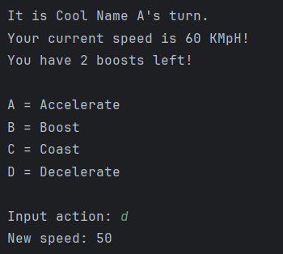
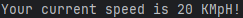
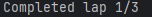

# Results of Testing

The test results show the actual outcome of the testing, following the [Test Plan](test-plan.md)

---

## Is The Track Set Up Properly

The track should have both racers and corners set up on it.

### Test Data Used

I ran the code and printed lists for racer one's position, racer two's position, and the location of the corners.

### Test Result

Track seems to be in working order, the cars are in the correct place, 
(The empty space at the start is to help them start a new lap.) and the corners (Represented by true.) are all where they should be.

---

## Can The Intro Collect And Store Player Inputs

The intro needs to get two types of player info, first, a string, most likely the players name, and two, a single letter, used for choices.

### Test Data Used

I input some player names to see if it can print them back at me, I tried answering a yes/no question with more than one letter,
and finally, I checked whether the yes/no question outputs the right response based on the player input.

### Test Result

As you can see, the program is able to easily retrieve and print player input, now, what about yes/no questions? 

Fortunately, the yes/no questions are functioning properly.

I also put in some invalid inputs to see its reaction, it didn't allow them, but it also didn't have an error message, sometimes it didn't even reprint the question, so I moved around some of the println's and questions, before adding in the error messages, here's the result:

---

## Does Each Player Get A Turn

Once player one has chosen an action, it should then switch to asking player two for an action.

### Test Data Used

Ran through the code to make sure it's updating the right variables

### Test Result

Yup, you can see here the use of the players name, indicating the turns are functioning properly.

---

## Does The Program Change The Player's Speed Based On What Option They Chose.

When a player chooses accelerate, it should increase their speed, when they choose decelerate, it should decrease etc.

### Test Data Used

I tried all of the different options and printed the speed after each one.

### Test Result

All options are functioning as intended, A raises speed by 10, B by 50, C keeps it the same, and D decreases it by 10.

If the player tries to boost without any boosts left, they get an error message.

---

## Do The Cars Move

The cars should move forward on the track in the amount of spaces correlating to their speed.

### Test Data Used

Ran the code, set the speed for the cars, and counted the amount of spaces they moved.

### Test Result

Car is going 50, moves 5 spaces.

Car is going 20, moves 2.

Everything seems to to be in working order.

---

## Can the cars go back to the start

Once a car completes a lap, it should be sent back to the start of the track.

### Test Data Used

I ran the code multiple times with the cars going at different speeds.

### Test Result

Old screenshot, but the code is still essentialy the same.

When I tested the results, the program returned that I was out of bounds.
This was because, after the program tries to move the car normally and failing, the spot that used to contain the car 
would remain empty, meaning the car didn't exist, so when I referenced the cars location later, it didn't know what I
was talking about, to fix this, I simply added a line of code to the catch after the try that replaced the car back 
where it should be.

After this, the code worked pretty well.

Car one's speed is 20, it moves once, then moves again, returning to the start of the list.

The car's speed is 40, it moves twice, goes to the start of the list, and then moves once more.

---

## Do The Cars Crash

When a car is going around a corner it should generate a number and based on the outcome, either crash or survive, the higher the number,
the bigger the chance to crash.

### Test Data Used

I drove the cars around corners at various speeds and recorded the outcome.

### Test Result

Car one is going 80, accelerates to 90, (A 100% chance to crash.) and crashes.

Car two is going 50, gets unlucky, and crashes.

Comment on test result. Comment on test result. Comment on test result. Comment on test result. Comment on test result. Comment on test result.

---

## Does The Boost Grant Invincibility

Using a boost on a corner should make you immune to crashing.

### Test Data Used

I will approach the corner at a speed which should have a 100% chance of crashing, then use a boost to go around the corner at high speeds.

### Test Result

Player one boosts to go 160 KMpH around a corner, usually well beyond possible, but the boost prevents the crash.

---

## Does The Number Of Laps Increase

When a car goes around the track, their number of laps completed should go up by one.

### Test Data Used

Go around the track and print the number of laps.

### Test Result

As Player two passes the finish line for the final time, the lap counter is set to three and the race ends.

---

## Does the track display properly

Once the players complete a round, (Two turns.) the program should print an image of the track with a number 1 and 2 showing where the cars are.

### Test Data Used

Run the code with the cars in different positions to see if everything is where it is meant to be.

### Test Result

Success! The cars all display properly, and the track looks great.

---

## Can You Win

Once a car completes 3 laps, the game should end, and they should be congratulated.

### Test Data Used

Win the race with both drivers and check the resulting message.

### Test Result

Victory message displays correctly for both players.

---